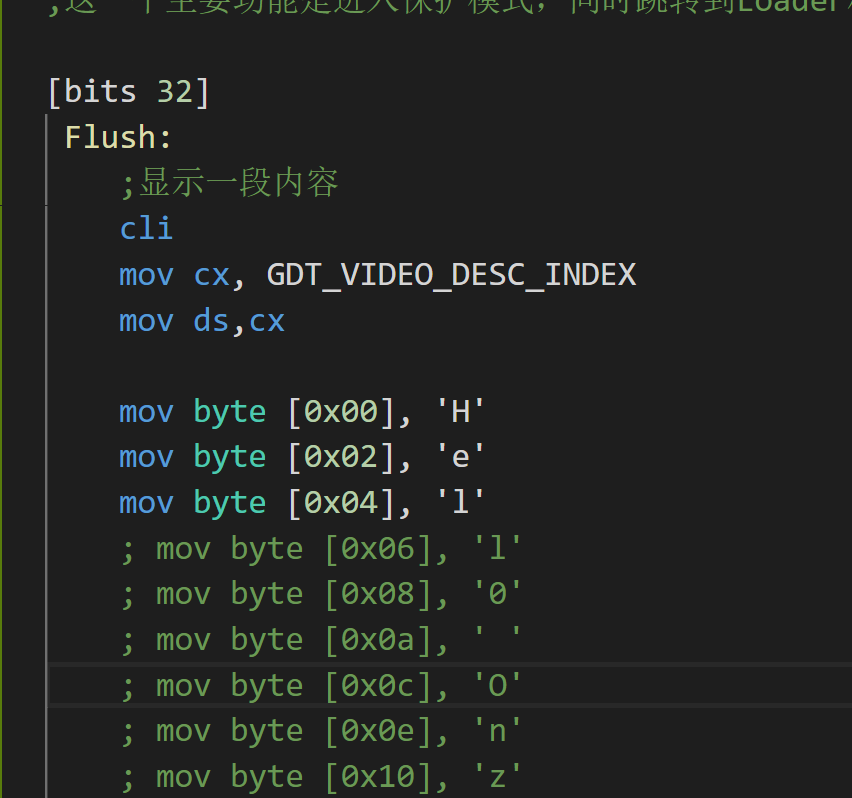
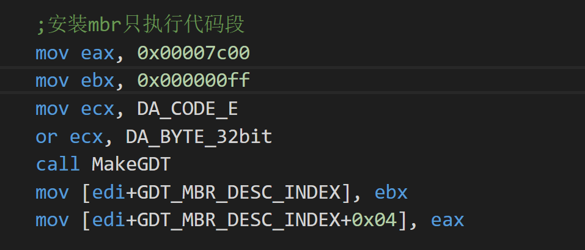
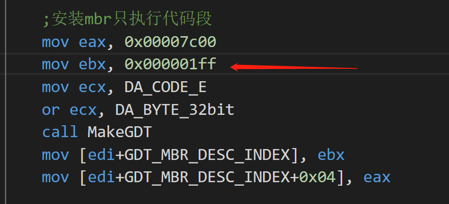

# 记录开发过程中遇到的Bug

| 时间    | 问题描述                  | 问题根源            | 解决方案          |
| :----: |  :------                  | :------            | :-------          |
| 2018/10/16 | 命令中可以正常执行命令，到了makefile中却频繁报错 \$(ASM) \$(ASMFLAGS) .\boot\mbr.asm -o mbr.bin 报错说有两个指定的输入文件| 猜测可能是因为makeFile的原因 | 路径分隔符从 windows 的 \ 改成Linux 下的 / 即解决问题 |
| 2018/10/16 | 进入保护模式后，在执行第三条mov 指令时莫名触发中断, 触发中断截图 |  一开始一直不明白，还以为是内存越界，但进过反复论证，只要第三条指令 mov 到内存就一定失败。后面方知我的描述符的界限写错了。我将512字节计算成 0xff 但是实际上是0x1ff。所以就出现了上面的问题。因为刚好到那一条指令就已经越界了。因为已经触发机器的段保护机制| 将描述符的代码修正一下，原来的如下： 改正后的描述符代码如下： |
